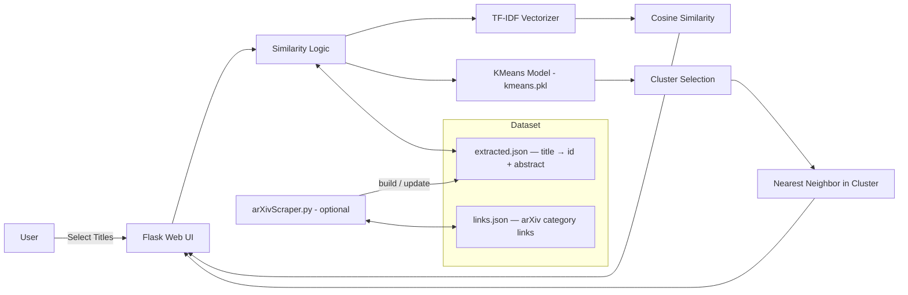

# 📄 **DocumentSimilarityFinder – arXiv Paper Similarity & Best-Match Search**


---

## ✨ Overview

**DocumentSimilarityFinder** is a Python project that helps you **compare research documents** using their abstracts and quickly identify **similar papers** from a local corpus.  
It combines TF-IDF similarity scoring, KMeans clustering for scalable best-match retrieval, and a lightweight Flask web UI — *"Pick two papers → get similarity. Pick one paper → get its closest match."*

---

## 🎯 Problem Statement

- 🔎 **Finding related papers is slow** when scanning titles and abstracts manually.
- 📄 **Abstracts carry the strongest signal**, but comparing them at scale is inefficient.
- 🧠 **Pairwise comparisons don't scale** as the corpus grows.
- 🧭 No quick way to both **measure similarity** and **recommend the nearest neighbor** from one interface.

---

## 💡 Solution: *DocumentSimilarityFinder*

| Feature | Description |
|----------|--------------|
| 🧾 **Abstract-Based Similarity** | Compares documents via TF-IDF vectors and cosine similarity. |
| 🔁 **Two-Document Comparison** | Computes similarity (%) between any two selected papers. |
| 🧩 **Best Match Recommendation** | Finds the most similar paper to a selected input (excluding itself). |
| 🧠 **KMeans Clustering** | Restricts similarity search to the most relevant cluster for faster lookup. |
| 🌐 **Flask Web UI** | Dropdown-based interface to run comparisons without touching the CLI. |
| 🗃️ **Dataset Builder** | Optional arXiv scraper to build and update the local JSON corpus. |

---

## 🧰 Tech Stack

| Layer | Technologies |
|-------|---------------|
| **Language** | Python |
| **Web App** | Flask, Jinja2 templates, static CSS/JS |
| **NLP / Similarity** | scikit-learn `TfidfVectorizer` + cosine similarity |
| **Clustering** | scikit-learn KMeans + joblib model persistence |
| **Data Collection** | requests + BeautifulSoup (arXiv scraping) |
| **Visualization** | matplotlib (elbow plot + cosine similarity plots) |

---

## 🏗️ Technical Architecture



---

## 🗂️ Repo Structure

```
DocumentSimilarityFinder/
├── document similarity/
│   ├── similarityFinderWebsite.py   # Flask app (web UI + routes)
│   ├── similarityFinder.py          # 2-doc similarity: TF-IDF + cosine
│   ├── bestSimilarityFinder.py      # Best-match finder via KMeans clusters
│   ├── kmeansModel.py               # Train + save KMeans model → kmeans.pkl
│   ├── arXivScraper.py              # Scrape arXiv → extracted.json
│   ├── extracted.json               # Dataset: title → {id, abstract}
│   ├── links.json                   # arXiv category links
│   ├── kmeans.pkl                   # Saved KMeans model
│   ├── templates/                   # Jinja2 HTML templates
│   └── static/                      # CSS / JS / assets
└── README.md
```

> ⚠️ Scripts use relative paths — always run commands from **inside** the `document similarity/` folder.

---

## ⚙️ Setup Guide

### 1️⃣ Clone Repository

```bash
git clone https://github.com/lekshman-babu/DocumentSimilarityFinder.git
cd DocumentSimilarityFinder
```

### 2️⃣ Create Virtual Environment

```bash
python -m venv .venv

# macOS/Linux:
source .venv/bin/activate
# Windows:
.venv\Scripts\activate
```

### 3️⃣ Install Dependencies

```bash
pip install flask scikit-learn joblib matplotlib requests beautifulsoup4 lxml
```

### 4️⃣ Run the Web App

```bash
cd "document similarity"
python similarityFinderWebsite.py
```

Open in browser: `http://localhost:5000`

---

## 🧪 Usage

### ✅ Option A — Web UI (Recommended)

1. Start the Flask app and open `http://localhost:5000`
2. Choose a mode from the homepage:
   - **Document Similarity Checker** — compare 2 documents
   - **Best Document Finder** — find the closest match to a selected paper
3. Select titles from the dropdown (populated from `extracted.json`) and submit

---

### ✅ Option B — CLI: Compare 2 Documents

```bash
cd "document similarity"
python similarityFinder.py
```

Enter two paper titles when prompted → returns a **similarity percentage**.

---

### ✅ Option C — CLI: Find Best Match

```bash
cd "document similarity"
python bestSimilarityFinder.py
```

Enter an input title when prompted → returns the **most similar document title**.

---

## 🔄 Updating the Dataset (Optional)

### Step 1 — Scrape arXiv to rebuild `extracted.json`

```bash
cd "document similarity"
python arXivScraper.py
```

The script is interactive — choose an arXiv category (or "all") and optionally set a document limit.

### Step 2 — Re-train the KMeans Model

```bash
python kmeansModel.py
```

- Displays an **elbow plot** to help choose the number of clusters
- Prompts for cluster count input
- Saves updated `kmeans.pkl`

---

## 📈 Business Impact

| Feature | Value |
|---------|-------|
| ⚡ **Speed** | Cluster-restricted search avoids brute-force pairwise comparison at scale. |
| 🎯 **Relevance** | Abstract-level TF-IDF captures semantic content better than title-only matching. |
| 🔁 **Extensibility** | Modular design — swap TF-IDF for embeddings or FAISS with minimal changes. |
| 🌐 **Accessibility** | Web UI removes CLI friction for non-technical users. |

---

## 🚀 DocumentSimilarityFinder 2.0 (Roadmap)

- 🧠 Replace TF-IDF with dense embeddings (SentenceTransformers / OpenAI)
- ⚡ Add ANN indexing (FAISS / Annoy) for large-scale corpora
- 🔍 Free-text input — paste any abstract instead of selecting from a dropdown
- 📊 Return top-K results with ranked similarity scores, not just top-1
- 🧼 Add `requirements.txt` + one-command setup script

---

## 🧑‍💻 Author

**Lekshman Babu** — Ira A. Fulton School of Engineering, Arizona State University

---

## 🪪 License

This project is licensed under the **MIT License**.  
See `LICENSE` for details.

---

> 📚 *"Pick two papers → get similarity. Pick one paper → get its closest match." — DocumentSimilarityFinder*
